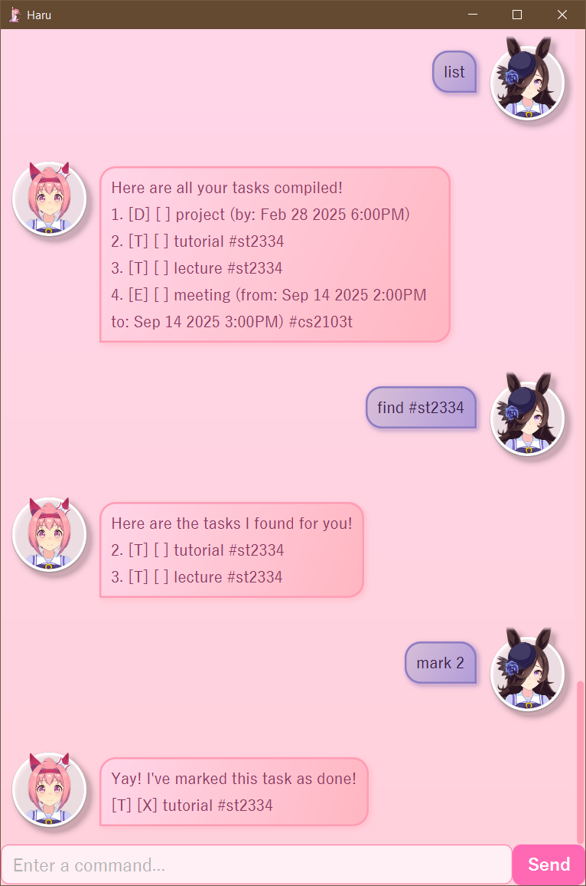

# Haru User Guide

Haru is a **task manager** application that organizes all your tasks in _one_ place! Whether it is an upcoming project 
meeting, a workshop, or an assignment, Haru can keep track of it all so that you are always up to date with events and 
deadlines! Haru is optimized for use via a Command Line Interface (CLI) while still having the benefits of a Graphical User Interface (GUI). If you can type fast, Haru can help you manage your tasks faster than traditional GUI apps!

## Table of Contents
- [Quick start](#quick-start)
- [Features](#features)
  - [Adding a task: `todo`, `deadline`, `event`](#adding-a-task-todo-deadline-event)
  - [Listing all tasks: `list`](#listing-all-tasks--list)
  - [Locating tasks by keyword: `find`](#locating-tasks-by-keyword-find)
  - [Deleting a task: `delete`](#deleting-a-task--delete)
  - [Mark a task as done: `mark`](#mark-a-task-as-done-mark)
  - [Unmark a task as done: `unmark`](#unmark-a-task-as-done-unmark)
  - [Tag a task: `tag`](#tag-a-task-tag)
  - [Untag a task: `untag`](#untag-a-task-untag)
  - [Exiting the program: `bye`](#exiting-the-program--bye)
- [Saving the data](#saving-the-data)
- [FAQ](#faq)

 

## Quick start
Ensure you have Java `17` or above installed in your Computer.
Mac users: Ensure you have the precise JDK version prescribed [here](https://se-education.org/guides/tutorials/javaInstallationMac.html).

Download the latest `.jar` file from [here](https://github.com/christopherchong/ip/releases/tag/v0.2).

Copy the file to the folder you want to use as the home folder for your task manager.

Open a command terminal, `cd` into the folder you put the jar file in, and use the `java -jar haru.jar` command to run the application.

 

## Features
### Adding a task: `todo`, `deadline`, `event`
Adds a task to the task list. Tasks is categorized by todo, deadline, and event.

#### Adding a `todo` task
Format: `todo (description)`

Example: 
- `todo watch lecture`
- `todo borrow book`

 

#### Adding a `deadline` task
Format: `deadline (description) /by (datetime)`
- `/by` datetime follow the `d/M/y Hmm` format. e.g. `30/12/2025 600` means `12 Dec 2025 6:00AM`
  
Example: 
- `deadline assignment /by 19/9/2025 2359`
- `deadline quiz /by 26/9/2025 2359`

 

#### Adding a `event` task
Format: `event (description) /from (datetime) /to (datetime)`
- `/from` and `/to` datetimes follow the `d/M/y Hmm` format. e.g. `30/12/2025 600` means `12 Dec 2025 6:00AM`
- `/from` datetime must be earlier than `/to` datetime.

Example: 
- `event project meeting /from 22/9/2025 1200 /to 22/9/2025 1300`
- `event workshop /from 20/9/2025 900 /to 20/9/2025 1200`

 

### Listing all tasks : `list`
Shows a list of all tasks in the task list.

Format: `list`

 

### Locating tasks by keyword: `find`
Finds tasks that contain the specified keyword.

Format: `find (keyword)`
- The search is case-insensitive. e.g. `project` will match `Project`
- The keyword can be the task type, name, date, or tag.
- Keywords do not need to be the full word e.g. `proj` will match `Project` 
 
 

### Deleting a task : `delete`
Deletes the specified task from the task list.

Format: `delete (index)`
- Deletes the task at the specified `index`.
- The index refers to the index number shown in the displayed task list.
- The index **must be a positive integer** 1, 2, 3, ...

 

### Mark a task as done: `mark`
Marks a specified task as completed. 

Format: `mark (index)`
- Marks the task at the specified `index`.
- The index refers to the index number shown in the displayed task list.
- The index **must be a positive integer** 1, 2, 3, ...

 

### Unmark a task as done: `unmark`
Unmarks a specified task as done. 

Format: `unmark (index)`
- Unmarks the task at the specified `index`.
- The index refers to the index number shown in the displayed task list.
- The index **must be a positive integer** 1, 2, 3, ...

 

### Tag a task: `tag`
Gives a specified task a specified tag. 

Format: `tag (index) #(tag name)`
- Tags the task at the specified `index`.
- The index refers to the index number shown in the displayed task list.
- The index **must be a positive integer** 1, 2, 3, ...

 

### Untag a task: `untag`
Removes a specified tag from a specified task. 

Format: `untag (index) #(tag name)`
- Untags the task at the specified `index`.
- The index refers to the index number shown in the displayed task list.
- The index **must be a positive integer** 1, 2, 3, ...

 

### Exiting the program : `bye`
Exits the program.

Format: `bye`

 

## Saving the data
Data in Haru is saved in the hard disk automatically after any command that changes the data. There is no need to save manually.

 

## FAQ
**Q**: How do I transfer my data to another Computer?

**A**: Install the app in the other computer and overwrite the empty data file it creates with the file that contains the data of your previous Haru home folder.
